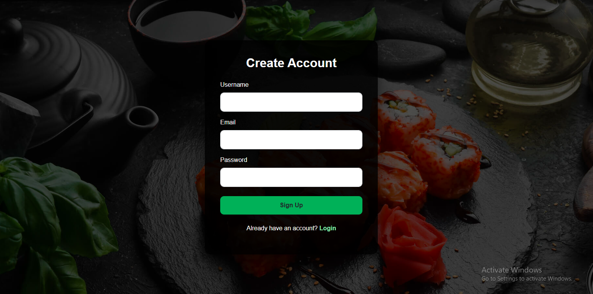
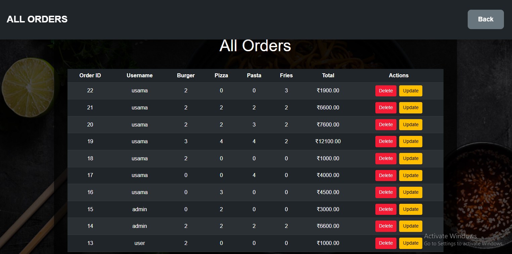

# 🍽️ Flask Food Ordering System – Full Stack Web Application

## 📌 Project Overview
This is a **Full-Stack Food Ordering Web Application** built with **Flask** and a relational database (PostgreSQL/MySQL).  
It features:

- User authentication (Sign Up & Login)
- Role-based access control (User & Admin)
- Secure password hashing
- Ordering system with Add, Update, Delete functionality
- Admin dashboard to manage all orders
- Responsive and clean UI

Users can place and manage orders, while admins can view, update, and delete all orders.  
The app demonstrates a complete **Flask + Database + Frontend** workflow.

---

## 🖥️ Screenshots

### Home Page


### Login Page


### Order Page


### Update Orders (Admin)


---

## ✨ Features

### User Features
- Sign Up / Login functionality
- Place orders from menu items
- Update own orders
- View personal order history

### Admin Features
- View all orders from users
- Update or delete any order
- See order summaries with pagination
- Dashboard shows total items ordered

### Security & Backend
- Passwords hashed using **Werkzeug**
- Role-based access control for users and admins
- Flask-Login for session management
- Database connection via PostgreSQL/MySQL
- Full CRUD (Create, Read, Update, Delete) operations

---

## 🛠️ Tech Stack
- **Backend:** Python, Flask, Flask-Login
- **Frontend:** HTML, CSS, Jinja2 templates
- **Database:** PostgreSQL / MySQL
- **Security:** Werkzeug password hashing

---

## 🚀 How to Run Locally

### 1️⃣ Clone the repository
```bash
git clone https://github.com/yourusername/Python-food-ordering-Full-Sack-with-Dtatabase.git
cd Python-food-ordering-Full-Sack-with-Dtatabase
